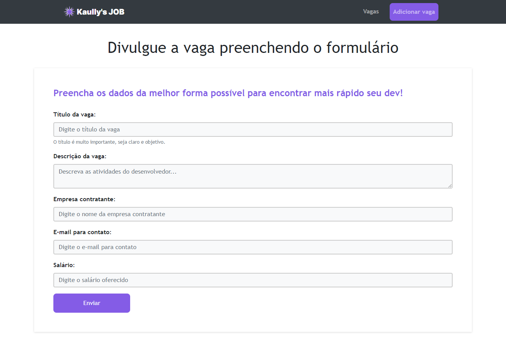
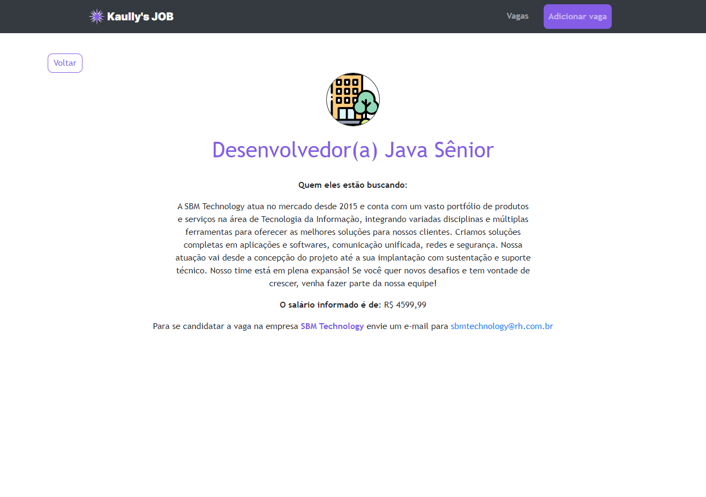

# 🧑‍💻 Kaully's JOB 

## Preview: Portal de Vagas de tecnologia

### 🌎 Página principal

### 🌎 Página principal (vagas)

### 🌎 Página de adicionar vaga

### 🌎 Página de visualizar vaga

> Projeto construído com base no projeto JobFinder feito através do curso "JavaScript do básico ao avançado (c/ Node.js e projetos)" na plataforma Udemy.

Projeto prático utilizando tecnologias em Javascript. 

## 🛠 Tecnologias:

- HTML
- CSS
- Bootstrap
- Javascript
- NodeJs
- Handlebars
- SQLite
- Git e Github

## 💻 Para rodar:
- Clone o repositório (git clone ou download)
- Abra a pasta com cmd (ou algum prompt) e rode o comando "npm run dev" (é necessário ter o nodejs instalado)
- A aplicação ira rodar na porta 3000 (localhost:3000)

## 💛 Contatos:

🌍 E-mail: matheuskaully@gmail.com
